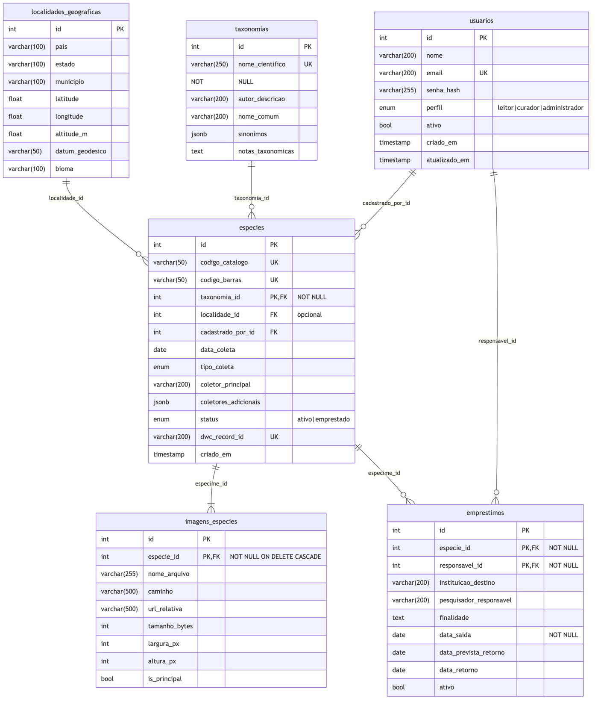
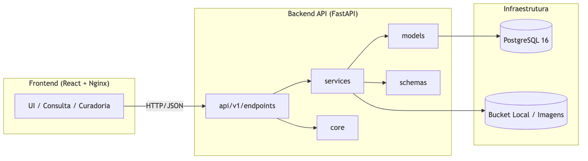

# Documento de Arquitetura — BioAcervo (Herbário Digital)

**Projeto:** Herbário Digital (BioAcervo) — Sistema de Gestão de Acervo Biológico
**Stack:** FastAPI (Python 3.11+), SQLAlchemy 2.0 (async), PostgreSQL 14+, Pydantic v2, Alembic
**Fonte da verdade:** `backend/app/models/models.py`, `backend/app/schemas/schemas.py`, `backend/app/services/`, `backend/app/api/v1/endpoints/`, `backend/app/core/`, `README.md`, `docker-compose.yml`

Este documento descreve a arquitetura de software do BioAcervo: visão em camadas,
fluxo de dependências, infraestrutura e decisões de design (ADRs resumidos). Os
diagramas que o acompanham — `er.png` (Modelo Entidade-Relacionamento), `pacotes.png`
(diagrama de pacotes/componentes) e `diagrama_classes.png` — são extraídos
fielmente do código-fonte.

---

## 1. Visão em Camadas

O BioAcervo segue uma **arquitetura em camadas estrita** (Layered Architecture), com
fluxo de dependência exclusivamente vertical e para baixo. Não há referências de
camadas inferiores para superiores.

```text
┌──────────────────────────────────────────────────────────────────────┐
│  Frontend (Nginx) — cliente web estático que consome a API (HTTPS+JWT) │
└───────────────────────────────────┬──────────────────────────────────┘
                                     │ chama
                                     ▼
┌──────────────────────────────────────────────────────────────────────┐
│  API / v1 / endpoints  (auth, especimes, taxonomia_localidade,         │
│                        usuarios_emprestimos) — FastAPI routers + guards │
└───────────────────────────────────┬──────────────────────────────────┘
                                     │ usa
                                     ▼
┌──────────────────────────────────────────────────────────────────────┐
│  services  (Camada de Regra de Negócio — métodos estáticos assíncronos) │
│   • EspecimeService  • UsuarioService  • ImagemService                  │
│   • ExportService / EtiquetaService                                     │
└───────────────────────────────────┬──────────────────────────────────┘
                                     │ mapeia
                                     ▼
┌──────────────────────────────────────────────────────────────────────┐
│  models + schemas  (Domínio)                                            │
│   • models.py (SQLAlchemy ORM)  • schemas.py (Pydantic v2)             │
│   • enums: PerfilUsuario, StatusEspecime, TipoColeta                    │
└───────────────────────────────────┬──────────────────────────────────┘
                                     │ persiste via
                                     ▼
┌──────────────────────────────────────────────────────────────────────┐
│  db / session  (Persistência)                                           │
│   • AsyncEngine (asyncpg)  • AsyncSession / get_db()  • Alembic         │
└───────────────────────────────────┬──────────────────────────────────┘
                                     │ SQL
                                     ▼
                         ┌───────────────────────┐
                         │   PostgreSQL (container) │
                         └───────────────────────┘
```

**Núcleo transversal (`core`):** `security.py` (JWT HS256, bcrypt, `require_roles()`)
e `config.py` (`Settings` Pydantic) são usados tanto pela API quanto pelos serviços,
mas não dependem de nenhuma camada superior.

**Infraestrutura externa:** `PostgreSQL` (serviço `database`) e `bucket local`
(serviço `bucket`, volume Docker para `uploads/images/{id}` e `uploads/exports`).

---

## 2. Fluxo de Dependências

A dependência flui: **endpoints → services → models/schemas → db → PostgreSQL**.

- **API (endpoints)** depende de `services` (orquestração) e de `core` (autenticação
  e autorização via `get_current_user` / `require_roles`).
- **services** dependem de `models`/`schemas` (tipos de domínio) e de `core`
  (hashing de senha, configurações). `ImagemService` escreve/le no **bucket local**.
- **db/session** encapsula o `AsyncEngine` (asyncpg) e a `AsyncSession`; `get_db()`
  garante `commit`/`rollback`/`close`. Alembic aplica migrações com driver síncrono
  (`DATABASE_URL_SYNC`).
- **core** depende de `config` e (indiretamente) de `db` para resolver o usuário do token.

```text
endpoints ──▶ services ──▶ models/schemas ──▶ db ──▶ PostgreSQL
    │            │            ▲                   │
    │            └──(bucket)──▶ Bucket local       │
    └──▶ core (auth/config) ──┘                    │
            ▲                                      │
            └──────── SECRET_KEY / SQL ────────────┘
```

---

## 3. Infraestrutura (Docker Compose)

Quatro serviços declarados em `docker-compose.yml`:

| Serviço | Imagem | Responsabilidade | Saúde |
|---|---|---|---|
| `database` | PostgreSQL (contexto `./database`) | Banco relacional `bioacervo`; volume `./database/data` | `pg_isready` |
| `backend` | FastAPI (contexto `./backend`) | API; volume `./bucket/data:/bucket`; `depends_on` database+bucket (healthy) | `GET /health` |
| `bucket` | bucket local (contexto `./bucket`) | Arquivos `images/` e `exports/`; volume `./bucket/data` | existe `/data/images` e `/data/exports` |
| `frontend` | Nginx (contexto `./frontend`) | Página estática; `depends_on` backend (healthy) | — |

A rede de dependência impõe ordem de inicialização: `database` e `bucket` saudáveis
antes de `backend`; `backend` saudável antes de `frontend`.

---

## 4. Camadas de Negócio (resumo dos services)

Cada serviço é uma classe de **métodos estáticos assíncronos** que recebe `AsyncSession`.

- **UsuarioService** — `authenticate` (bcrypt + flag `ativo`), `create` (hash de senha,
  nunca texto plano), `update` (re-hash quando senha presente), `get_by_email`/`get_by_id`,
  `listar`, `delete`.
- **EspecimeService** — `create` gera `dwc_record_id="urn:uuid:..."` e
  `codigo_barras="SPEC-..."`, define `cadastrado_por_id` e `data_entrada_colecao`;
  `buscar(filtros)` monta consulta dinâmica com JOIN a Taxonomia/Localidade (filtros
  taxonômicos, geográficos, bounding box, coletor, status, intervalo de datas, paginação).
- **ImagemService** — `upload` valida tamanho (20 MB), abre com PIL, confere formato,
  **sanitiza** (re-salva descartando metadados, proteção contra DecompressionBomb),
  grava em `uploads/images/{especime_id}/`; `is_principal` desmarca anteriores;
  `deletar` remove arquivo físico + registro.
- **ExportService / EtiquetaService** — `exportar_dwca(ids?)` gera em memória um ZIP com
  `occurrence.csv` (mapeamento Darwin Core de 32 campos), `meta.xml` (TDWG) e `eml.xml`
  (EML 2.1.1); `gerar_etiqueta_pdf` produz etiqueta A6 paisagem com Code128.

---

## 5. Fluxos de API (prefixo `/api/v1`)

| Método | Rota | Serviço | Guarda |
|--------|------|---------|--------|
| POST | `/auth/login` | UsuarioService.authenticate | público |
| POST | `/auth/registrar` | UsuarioService.create | admin |
| GET | `/auth/me` | — | autenticado |
| GET/POST | `/especimes`, `/especimes/buscar` | EspecimeService | autenticado |
| POST | `/especimes` | EspecimeService.create | admin/curador |
| GET/PUT/DELETE | `/especimes/{id}` | EspecimeService | autenticado / admin-curador / admin |
| POST/GET/DELETE | `/especimes/{id}/imagens[...]` | ImagemService | admin/curador |
| GET | `/especimes/{id}/etiqueta` | EtiquetaService | autenticado |
| POST/GET | `/especimes/exportar/dwca[...]` | ExportService | admin/curador |
| GET/POST/DELETE | `/taxonomias`, `/localidades` | — | por perfil |
| GET/POST/DELETE | `/usuarios` | UsuarioService | por perfil |
| GET/POST/PUT | `/emprestimos` | EspecimeService (transição) | admin/curador |

### 5.1 Sequência — Criar Espécime

1. `POST /api/v1/especimes`: endpoint valida DTO `EspecimeCreate` e aplica
   `require_roles("administrador","curador")`.
2. `EspecimeService.get_by_codigo` → 400 se `codigo_catalogo` duplicado.
3. `EspecimeService.create` gera `codigo_barras`/`dwc_record_id`, define
   `cadastrado_por_id`, persiste.
4. `get_db` efetiva `commit`; retorna `EspecimeOut` (201).

---

## 6. Ciclo de Empréstimo (máquina de estado do Espécime)

O empréstimo é implementado como **transição de estado** do espécime, garantida na
mesma transação (`get_db` faz commit/rollback).

```text
   [ativo] ── POST /emprestimos (status==ativo) ──▶ [emprestado]
      ▲                                                  │
      │                                                  │ consultável; não inicia novo empréstimo
      │                                                  ▼
      └── PUT /emprestimos/{id} (data_retorno) ──────────┘
            (emprestimo.ativo=False; status->ativo)

   Estados alternativos: em_processamento (curadoria), descartado (baixa definitiva).
```

- **Pré-condição (criar):** espécime existe e `status == "ativo"`.
- **Pós-condição (criar):** novo `Emprestimo` (`ativo=True`); `especime.status = "emprestado"`.
- **Pós-condição (retornar):** `emprestimo.ativo = False`; `especime.status = "ativo"`.

### 6.1 Autorização (Core)

`app/core/security.py` provê `get_current_user` (decodifica JWT HS256) e
`require_roles(*perfis)` (guarda de dependência):

- `administrador`: CRUD total, usuários, deleções, exportações.
- `curador`: criar/editar espécimes, taxonomias, localidades, empréstimos, exportar.
- `leitor`: somente leitura e exportação.

Usuários só editam a si próprios, salvo administrador.

---

## 7. Modelo de Dados (ER e Classes)

### 7.1 Entidades

- **usuarios** (`Usuario`): `id` PK, `nome`, `email` (unique), `senha_hash`, `perfil`
  (Enum), `ativo`, `criado_em`, `atualizado_em`.
- **taxonomias** (`Taxonomia`): `id` PK, `reino`, `filo`, `classe`, `ordem`, `familia`
  (idx), `genero` (idx), `epiteto_especifico`, `nome_cientifico` (not null, idx),
  `autor_descricao`, `ano_descricao`, `nome_comum`, `sinonimos` (JSONB),
  `notas_taxonomicas`, `criado_em`, `atualizado_em`.
- **localidades_geograficas** (`LocalidadeGeografica`): `id` PK, `pais` (default Brasil),
  `estado`, `municipio`, `localidade`, `latitude`, `longitude`, `altitude_m`,
  `datum_geodesico` (default WGS84), `precisao_coordenadas_m`, `metodo_geolocalizacao`,
  `bioma`, `criado_em`.
- **especimes** (`Especime`): núcleo do acervo — `id` PK, `codigo_catalogo` (unique),
  `codigo_barras` (unique), `taxonomia_id` FK (not null), `localidade_id` FK,
  `data_coleta`, `data_coleta_fim`, `tipo_coleta` (Enum), `coletor_principal`,
  `coletores_adicionais` (JSONB), `numero_campo`, `sexo`, `estagio_vida`, `condicao`,
  `numero_individuos`, `descricao_morfologica`, `observacoes`, `habitat`,
  `identificado_por`, `data_identificacao`, `metodo_identificacao`, `nivel_confianca_id`,
  `voucher_genbank`, `status` (Enum), `localizacao_fisica`, `meio_preservacao`,
  `data_entrada_colecao`, `dwc_record_id` (unique), `dwc_dataset_id`,
  `referencias_bibliograficas` (JSONB), `direitos` (default CC BY 4.0), `licenca`,
  `cadastrado_por_id` FK, `criado_em`, `atualizado_em`.
- **imagens_especimes** (`ImagemEspecime`): `id` PK, `especime_id` FK (ON DELETE CASCADE),
  `nome_arquivo`, `caminho`, `url_relativa`, `tipo_mime`, `tamanho_bytes`, `largura_px`,
  `altura_px`, `descricao`, `is_principal`, `criado_em`.
- **emprestimos** (`Emprestimo`): `id` PK, `especime_id` FK (not null), `responsavel_id` FK
  (not null), `instituicao_destino`, `pesquisador_responsavel`, `finalidade`, `data_saida`
  (not null), `data_prevista_retorno`, `data_retorno`, `observacoes`, `ativo` (default True),
  `criado_em`.

### 7.2 Enums

- **PerfilUsuario:** `administrador`, `curador`, `leitor`.
- **StatusEspecime:** `ativo`, `emprestado`, `em_processamento`, `descartado`.
- **TipoColeta:** `campo`, `doacao`, `intercambio`, `compra`.

### 7.3 Relacionamentos (ER)

Chaves estrangeiras:
- `especimes.taxonomia_id` → `taxonomias.id` (N:1, obrigatório)
- `especimes.localidade_id` → `localidades_geograficas.id` (N:1, opcional)
- `especimes.cadastrado_por_id` → `usuarios.id` (N:1)
- `imagens_especimes.especime_id` → `especimes.id` (1:N, CASCADE)
- `emprestimos.especime_id` → `especimes.id` (1:N)
- `emprestimos.responsavel_id` → `usuarios.id` (1:N)

Restrições `UNIQUE`: `codigo_catalogo`, `codigo_barras`, `dwc_record_id`, `email`,
`nome_cientifico`. Campos `JSONB` (`sinonimos`, `coletores_adicionais`,
`referencias_bibliograficas`) e índice trigrama em `nome_cientifico` habilitam buscas.

### 7.4 Diagramas



*Figura 1 — Modelo Entidade-Relacionamento (fiel a `models.py`).*



*Figura 2 — Camadas api / services / models / db + núcleo transversal e infraestrutura.*

---

## 8. Decisões de Design (ADRs Resumidos)

**ADR-001 — Arquitetura em camadas estritas.**
Opções: (A) camadas estritas com serviços sem estado; (B) modelo anêmico (lógica nos
endpoints); (C) arquitetura hexagonal. Escolha: (A). Consequências: coesão alta e
testabilidade; serviços recebem `AsyncSession`. Rejeitou-se (B) por acoplar regra de
negócio à apresentação e (C) por sobrecarga desnecessária a um CRUD com exportações.

**ADR-002 — ORM assíncrono (SQLAlchemy 2.0 + asyncpg).**
Opções: (A) asyncpg para runtime + psycopg2 síncrono para Alembic; (B) só psycopg2.
Escolha: (A), mantendo `DATABASE_URL_SYNC` para migrações. Consequências: melhor
throughput de I/O; custo de duas URLs de conexão na configuração.

**ADR-003 — Autenticação JWT (HS256) + hash bcrypt.**
Opções: (A) JWT HS256 com bcrypt; (B) sessões server-side; (C) OAuth2 externo.
Escolha: (A). Consequências: stateless, adequado a API; bcrypt impede recuperação de
senhas. Risco: `SECRET_KEY` compartilhada — trocar em produção (sinalizado no README).

**ADR-004 — Bucket local em volume em vez de objeto store (S3).**
Opções: (A) sistema de arquivos local montado em volume Docker; (B) S3/MinIO. Escolha:
(A) para simplicidade de deployment single-host. Consequências: zero custo extra e
backup fácil via volume; limita escala horizontal. Aceitável para o escopo atual.

**ADR-005 — Sanitização de imagem via re-salvar com PIL.**
Opções: (A) salvar bytes recebidos direto; (B) abrir com PIL, validar e re-salvar.
Escolha: (B). Consequências: elimina metadados maliciosos e protege contra
DecompressionBomb; custo de CPU no upload. Formatos: JPEG/PNG/TIFF/WebP.

**ADR-006 — Exportação DwC-A em memória (ZIP).**
Opções: (A) montar ZIP em memória; (B) arquivos temporários no disco. Escolha: (A).
Consequências: sem resíduo de temporários; limitado pela memória para coleções muito
grandes (aceitável; exportação por seleção de IDs disponível).

---

## 9. Persistência e Migrações

- Engine assíncrono `create_async_engine` (pool 10 + overflow 20, `pool_pre_ping`).
- `async_sessionmaker` + `get_db` garante `commit`/`rollback`/`close`.
- Migrações versionadas por **Alembic** (`alembic upgrade head`). Seed cria admin conforme
  `ADMIN_EMAIL`/`ADMIN_PASSWORD` (ou credenciais locais em dev).

---

## 10. Conclusão

O BioAcervo apresenta arquitetura em camadas coesa, domínio rico (6 entidades + 3 enums),
persistência relacional fiel ao modelo de classes e ciclo de empréstimo implementado como
transição de estado do espécime. Os diagramas (`er.png`, `pacotes.png`, `diagrama_classes.png`)
e este documento refletem exclusivamente o código lido em `backend/app/`.
